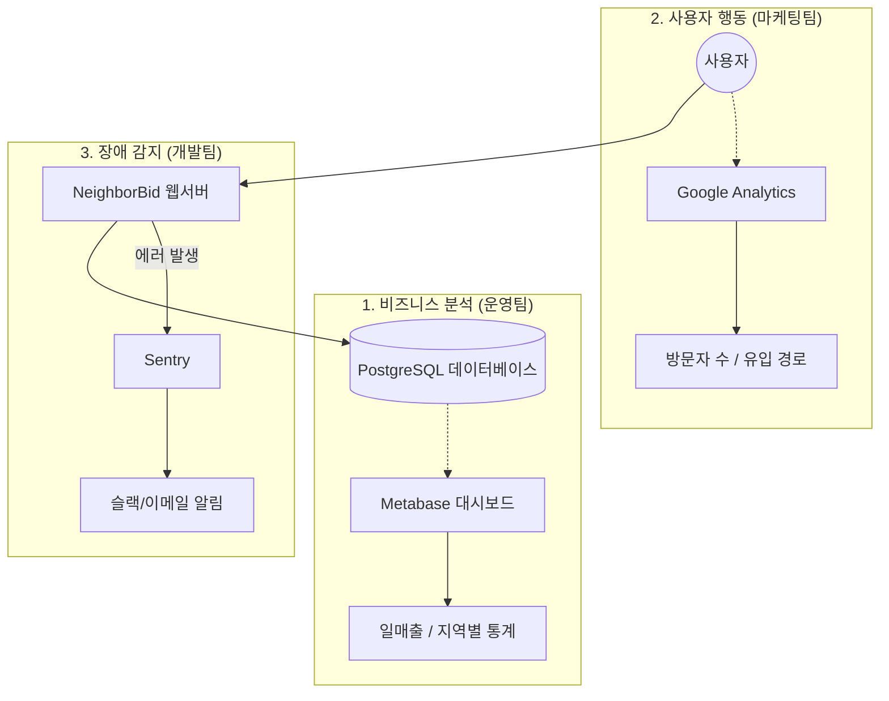

# NeighborBid 서버 모니터링 시스템 구축 제안서

## 1. 개요 (Background)
현재 NeighborBid 서비스는 AWS Lightsail 기반의 Docker 환경에서 성공적으로 런칭되었습니다.  
이제 안정적인 운영과 비즈니스 성장을 위해 **"사용자 트래픽, 매출 지표, 서버 상태"**를 한눈에 파악할 수 있는 체계적인 모니터링 시스템 구축이 필요합니다.

본 문서는 **최소한의 비용과 개발 리소스**로 **최적의 운영 효율**을 낼 수 있는 모니터링 구축 방안을 제안합니다.

---

## 2. 목표 (Objectives)
운영자 관점에서 반드시 확인해야 할 아래 3가지 핵심 영역을 커버합니다.

| 영역 | 핵심 질문 |
|---|---|
| **1. 비즈니스 (Business)** | "오늘 얼마 벌었나? 어떤 상품이 강남구에서 인기 있나?" |
| **2. 사용자 (User)** | "몇 명이 방문했나? 어디서 이탈했나?" |
| **3. 안정성 (Tech)** | "서버가 죽진 않았나? 결제 오류는 없었나?" |

---

## 3. 구축 전략 : "3-Tool Approach"
모든 기능을 하나에 억지로 넣는 개발(자체 구축) 대신, 각 영역에서 가장 강력하고 **검증된 무료/오픈소스 도구 3가지**를 조합하여 도입합니다.

### 2.1 도구 구성도

---

## 4. 상세 도입 방안

### ① 비즈니스 데이터 시각화 : **Metabase** (최우선 추천)
DB에 쌓여있는 데이터를 그래프와 차트로 보여주는 BI(Business Intelligence) 도구입니다.
*   **역할**: 일일 트래픽, 상품별/지역별/결제 기록 분석.
*   **장점**:
    *   **Open Source**: 무료로 설치 가능 (Docker 컨테이너 1개 추가면 끝).
    *   **No-Code**: 개발자가 쿼리를 짜주지 않아도, 운영자가 클릭만으로 그래프 생성 가능.
    *   **실시간성**: DB를 직접 조회하므로 데이터가 가장 정확함.
*   **예상 구축 시간**: 약 30분 (Docker 설정 및 DB 연결).

### ② 사용자 행동 로그 : **Google Analytics 4 (GA4)**
*   **역할**: 회원가입 전 단순 방문자 집계 및 유입 경로 파악.
*   **장점**: 전 세계 표준 도구. 무료.
*   **구축 방법**: 프론트엔드 코드(`base.html`)에 스크립트 한 줄 삽입.

### ③ 서버 장애 모니터링 : **AWS Monitoring + Sentry**
*   **AWS Lightsail**: CPU, 메모리, 네트워크 사용량 등 기초 인프라 지표 제공 (기본 기능).
*   **Sentry**:
    *   **역할**: 500 에러(서버 오류) 발생 시 즉시 감지 및 알림.
    *   **필요성**: 로그 파일을 매번 열어볼 수 없으므로, 장애 발생 시 1초 만에 알림을 받기 위함.
    *   **비용**: 월 5,000 건 이벤트까지 무료 (스타트업 초기 단계에 충분).

---

## 5. 자체 구축 vs 도구 도입 비교

| 구분 | **제안 방식 (Metabase + GA4)** | 자체 개발 (Admin 페이지 확장) |
|:---:|---|---|
| **개발 비용** | **0원** (오픈소스 활용) | **높음** (차트 라이브러리 연동 및 UI 개발 필요) |
| **개발 기간** | **1일** (설정만 하면 됨) | **1~2주 이상** (기획+디자인+개발) |
| **유연성** | 높음 (클릭 몇 번으로 보고서 수정 가능) | 낮음 (보고서 수정 시마다 코드 수정 필요) |
| **품질** | 사용자 친화적인 전문 UI | 개발자 역량에 따라 다름 |

---

## 6. 향후 로드맵 (Action Plan)

팀 내 합의가 이루어지면 아래 순서대로 즉시 적용 가능합니다.

1.  **Phase 1 (즉시)**: `docker-compose`에 **Metabase** 컨테이너 추가 및 배포.
    *   결과물: **"관리자용 대시보드 URL"** 생성 및 접속 가능.
2.  **Phase 2 (0.5일 소요)**: Django 설정에 **Sentry SDK** 연동.
    *   결과물: 에러 발생 시 이메일 수신 확인.
3.  **Phase 3 (상시)**: 마케팅 시작 시점에 **GA4 스크립트** 삽입.

---
**결론**:  
빠른 실행과 데이터 기반 운영을 위해 **"Metabase"**를 우선 도입하여, 우리 서버에 쌓이고 있는 데이터를 시각화하는 것을 추천합니다.
